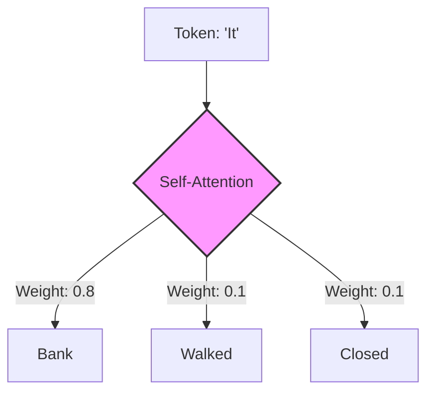

# Foundational Mechanics of Transformer-Based Language Models: From Tokenization to Inference

### 1. Byte Pair Encoding (BPE)
Byte Pair Encoding represents a sophisticated middle ground between character-level and word-level tokenization.
* **The Problem:** Utilizing full words leads to an intractable vocabulary size, as every morphological variation (e.g., "run", "running", "runner") requires a discrete entry. Conversely, character-level processing is computationally inefficient for capturing high-level semantic concepts.
* **The Solution:** BPE iteratively identifies and merges the most frequent sequences of characters into sub-word units (tokens). This enables the model to process out-of-vocabulary words by decomposing them into known constituent fragments.

---

### 2. Self-Attention
Self-attention is the mechanism that enables a model to establish contextual dependencies within a sequence.
* **Function:** It allows each token to "attend" to every other token in a sentence to determine their relative importance. For instance, in the phrase *"The bank was closed, so I walked away from it,"* self-attention assigns a high weight to "bank" when processing the pronoun "it," thereby resolving co-reference.

---

### 3. Positional Encoding
Unlike Recurrent Neural Networks (RNNs), Transformers process all tokens in a sequence simultaneously (in parallel).
* **The Problem:** Parallel processing lacks an inherent mechanism to recognize the temporal order of tokens.
* **The Solution:** A "positional vector" is added to the input embeddings. This provides each token with a unique identifier regarding its location in the sequence, ensuring the model can distinguish between sentences like *"The dog bites the man"* and *"The man bites the dog."*

---

### 4. Query (Q), Key (K), and Value (V)
This triad constitutes the mathematical engine of the attention mechanism, analogous to a database retrieval system:
* **Query (Q):** Represents the current token seeking information.
* **Key (K):** Serves as an index or label for all other tokens in the sequence.
* **Value (V):** Contains the actual information to be extracted.
* **Mechanism:** The model calculates the scaled dot-product between $Q$ and $K$ to determine a compatibility score.

$$ \text{Attention}(Q, K, V) = \text{softmax}\left(\frac{QK^T}{\sqrt{d_k}}\right)V $$

---

### 5. Weight Tying
Weight tying is an optimization technique used to enhance model efficiency.
* **Logic:** LLMs employ an embedding table at the input and a linear projection layer at the output. Since both deal with the same vocabulary, the model shares the same weight matrix for both layers. This reduces the total parameter count by approximately 15-30% in typical architectures.

---

### 6. Masked Self-Attention
This is the fundamental architectural distinction between encoders (e.g., BERT) and auto-regressive decoders (e.g., GPT).
* **The Decoder Mechanism:** During training, the model must not "cheat" by seeing future tokens. Masking ensures that when predicting the $n$-th token, the model can only attend to tokens from $1$ to $n-1$.

---

### 7. Gaussian Error Linear Unit (GELU)
Activation functions introduce non-linearity, allowing neural networks to model complex patterns.
* **Rationale:** While ReLU abruptly nullifies negative values, GELU provides a smoother, probabilistic transition. This curvature facilitates more robust gradient flow during the training of deep architectures.

---

### 8. Temperature Scaling
Temperature is a hyperparameter utilized during inference to regulate the stochasticity of the output.
* **Low Temperature (e.g., 0.1):** Sharpens the probability distribution, making the model deterministic and focused on the most likely tokens.
* **High Temperature (e.g., 1.0–1.5):** Flattens the distribution, increasing the likelihood of selecting lower-probability tokens, which results in more diverse or "creative" linguistic output.

---

### 9. Layer Normalization (LayerNorm)
In deep architectures, internal activations can fluctuate, leading to vanishing or exploding gradients.
* **Function:** LayerNorm re-centers and re-scales the inputs to each layer (mean of zero, unit variance). This stabilization is critical for training stability.

---

### 10. Context Window
The context window defines the operational memory limit of the model during a single forward pass.
* **Constraints:** Because attention memory requirements scale quadratically ($O(n^2)$) with sequence length, models are restricted to a fixed maximum number of tokens. Information residing outside this window is effectively ignored.